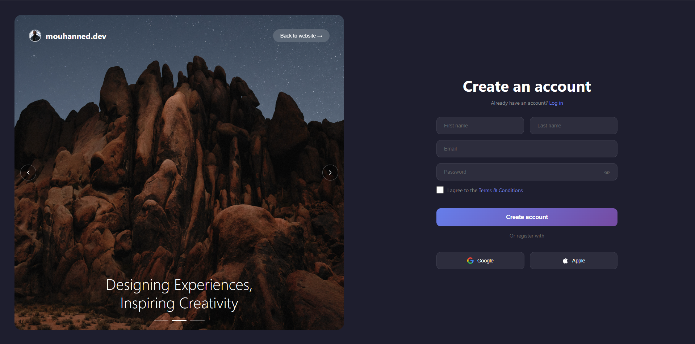

# SignUp — React (Vite)

## Caractéristiques
- Slider d’images avec flèches et points de navigation
- Formulaire d’inscription (nom, email, mot de passe, CGU)
- Toggle d’affichage du mot de passe
- Modale de vérification d’email
- Scanner QR/barcode via `BarcodeDetector`, fallback `jsQR`
- Design plein écran, colonne gauche en image edge‑to‑edge, colonne droite centrée

## Architecture
- `src/App.jsx` — layout deux colonnes, image du slide et orchestration (`reactjs/src/App.jsx`)
- `src/components/Slider.jsx` — flèches, auto‑rotation et dots (`reactjs/src/components/Slider.jsx`)
- `src/components/SignupForm.jsx` — formulaire + scanner et modale scanner (`reactjs/src/components/SignupForm.jsx`)
- `src/components/EmailModal.jsx` — modale de vérification d’email (`reactjs/src/components/EmailModal.jsx`)
- `src/index.css` — styles globaux (layout, inputs, modales, slider, dots) (`reactjs/src/index.css`)
- `public/Images/*` — assets (slides, favicon, avatar)

## Démarrage
- `npm install`
- `npm run dev`
- Ouvrir `http://localhost:5173/`

## Scanner
- Utilise l’API `BarcodeDetector` quand disponible (Chrome/Android récents)
- Fallback `jsQR` depuis un `canvas` si `BarcodeDetector` n’est pas supporté
- Actions: bouton "Open scanner" puis "Start" pour lancer la caméra

## Personnalisation
- Slider: modifier le tableau `slides` (images et texte) dans `src/App.jsx`
- Dots: styles dans `.carousel-dots` et `.dot` (`reactjs/src/index.css`)
- Couleurs et paddings: ajuster dans `src/index.css`
- Modales/formulaire: adapter les composants dans `src/components/*`

